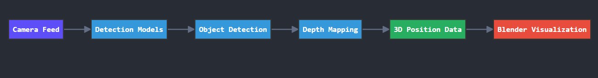

# HIFAR Drive - A User-Friendly Integrated Visual Perception Pipeline for Autonomous Driving Systems

This repository presents a modular and interactive pipeline that integrates multiple computer vision techniques—depth estimation, optical flow, segmentation, object detection, and pose estimation—into a unified 3D visualization framework. The goal is to enable intuitive scene understanding for autonomous navigation.

## 📌 Key Features

-  **Depth Estimation** using monocular image inputs
-  **Optical Flow** for motion tracking between frames
-  **Color and Instance Segmentation** for identifying lane markings and road users
-  **Object Detection** with bounding box overlays
-  **Pose Estimation** for pedestrians
-  Unified pipeline with modular architecture and visual output renderer

Read the full [report](./Report.pdf) for more details. 

## Perception Pipeline Overview

 

The perception pipeline converts raw camera feed videos into a 3D virtual scene through the following stages:

1. **Object Detection**  
   The input video is first processed using state-of-the-art object detection models like [YOLO3D](https://github.com/ruhyadi/YOLO3D) and [DETiC](https://github.com/facebookresearch/Detic) to identify and classify objects in the scene.

2. **Depth Estimation**  
   Detected objects are augmented with per-pixel depth information using [Marigold](https://github.com/prs-eth/Marigold), enabling accurate estimation of 3D positions.

3. **3D Visualization**  
   The 3D positions of the detected objects are used to spawn virtual objects within a Blender scene, creating a realistic digital twin for further visualization and analysis.

This modular pipeline enables comprehensive scene understanding for downstream tasks like autonomy, simulation, and analytics.

---

This project has also been showcased in a [Product Pitch Video](https://www.youtube.com/watch?v=IlkewlcQNXE), highlighting the most notable features of the pipeline. The motive behind making this is to present the work as an engaging, product-oriented walkthrough that anyone can understand, ranging from laypersons to experts in the field. 

